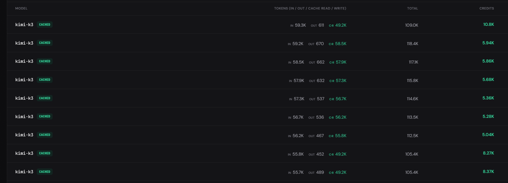
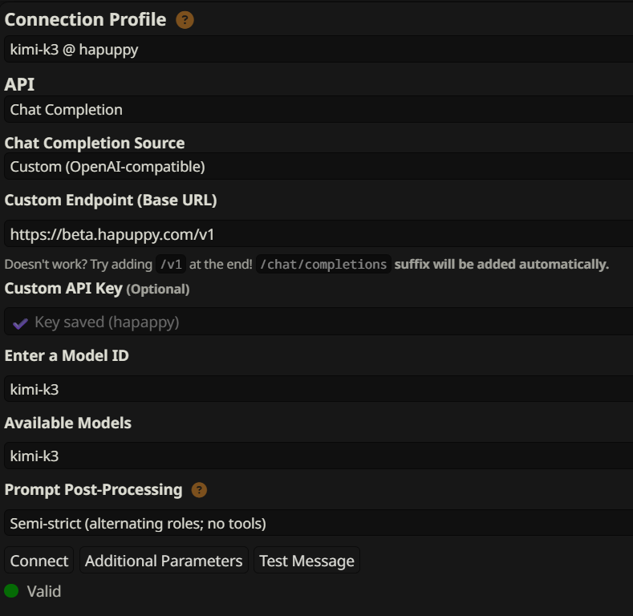
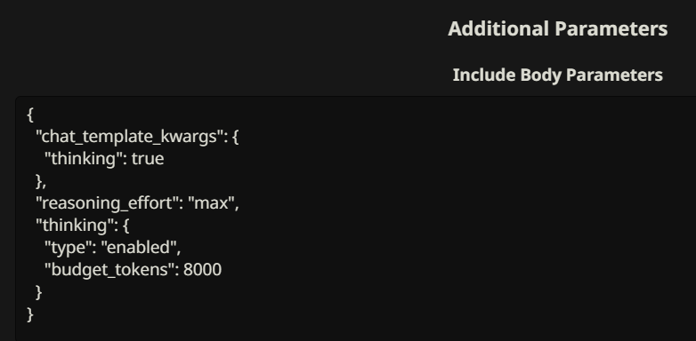

# Summaryception

Layered recursive memory for SillyTavern.

> [!IMPORTANT]
> This is the unofficial Append Only continuation maintained by JesseG689 from vadash's Summaryception 22.19 code. Upstream 22.20 removed Append Only; this fork deliberately retains its strict cache-prefix behavior, lorebook baking, and migration commands. Upstream fixes will be reviewed and ported selectively when they do not compromise Append Only.

Summaryception is for long roleplay chats that should remember what happened without shoving the whole backstory into every prompt. It runs as a plain browser extension inside [SillyTavern](https://github.com/SillyTavern/SillyTavern). No build step, no server, no database.

The short version: recent chat stays verbatim. Older chat becomes compact memory. The original messages stay in the chat UI, but Summaryception hides them from the model once they are covered by memory.

## Why this exists

Long chats usually fail in one of two boring ways.

You keep too much raw chat, so every generation drags a huge pile of old prose through the context window. Or you keep one normal summary, watch it blur details together, and start adding more raw chat again to compensate.

Summaryception takes the other route. It summarizes older chat in small pieces, then summarizes those summaries again when they pile up. The result is a memory stack: recent text at the bottom, compact turn summaries above it, deeper summaries above those.

```text
Current chat
|
|  Older messages: ghosted from the model, still visible to you
|  Recent messages: sent word for word
|
|  Injected memory:
|
|  Layer 2+  deep memory from promoted summaries
|  Layer 1   merged Layer 0 summaries
|  Layer 0   direct summaries of chat turns
|  Verbatim  the live recent window
```

That sounds abstract until you hit a 2,000 message chat and the model still remembers who promised what, who is injured, where the party left the key, and which subplot was quietly waiting in the corner.

## What it does

- Keeps a rolling verbatim window for recent chat.
- Compresses older chat into Layer 0 memories.
- Promotes older Layer 0 memories into deeper layers when the layer gets crowded.
- Separates narrative continuity from a compact rolling state snapshot using `[NARRATIVE]` and `[STATE]`.
- Ghosts summarized messages with SillyTavern's `/hide`, so they stop reaching the model but remain readable in the UI.
- Injects the assembled memory through SillyTavern extension prompts, or exposes it as `{{summaryception_memory}}` for custom prompt layouts.
- Runs background summarization without mutating the prompt during an active generation.

## Install

Requirements: the latest stable SillyTavern release.

In SillyTavern:

1. Open Extensions.
2. Choose Install Extension.
3. Paste `https://github.com/JesseG689/Extension-Summaryception-AppendOnly`.
4. Install, then open Summaryception in extension settings.

### Existing Summaryception installations

Do not install this fork beside an existing `Extension-Summaryception` copy. That would load both extensions against the same settings and chat metadata. Back up any local edits, stop SillyTavern, and repoint the existing extension checkout instead:

```bash
git remote set-url origin https://github.com/JesseG689/Extension-Summaryception-AppendOnly.git
git fetch origin
git switch -C append-only --track origin/append-only
```

The existing folder may keep its old name. Fresh installations use `Extension-Summaryception-AppendOnly`; template loading supports both names.

## First setup

Start with Easy mode unless you already know what you want to tune.

Set Fast Summarizer to your normal API or a SillyTavern Connection Profile. This model handles raw chat to Layer 0 summaries, so it should be cheap, fast, and good enough at extracting facts.

Smart Deep Memory is optional. Use it when you want Layer 1+ merges to use a stronger model than the raw-chat summarizer.

Then pick a memory mode. The provider's cache rules decide whether the fancy options save money or merely make the prompt fatter.

### Default

Use this unless you have a good reason not to. Default keeps recent chat near the 22k verbatim target and summarizes overflow as it arrives. The goal is simple: keep the model inside a useful context range without relying on provider caching.

This mode works everywhere and keeps context size fairly steady. If cached input is not much cheaper than normal input, stop here. You are done.

### Prefix Cache

Use Prefix Cache with the normal prompt caches offered by most providers. It lets live chat grow to 32k so more of each request can stay cached.

Suppose the next request keeps the same start but changes the tail. A normal prefix cache can still reuse that unchanged start. Your usual lorebooks work normally; no migration or special outlet is needed.

Pick this mode when cached input is cheaper and your provider supports that kind of partial prefix reuse. The tradeoff is a larger prompt. A summary flush also gives the provider a new prefix to cache.

### Append Only

Append Only is for stricter providers. They only give a useful cache hit when the old request is the exact start of the new one: each request must only append to the last, never change an earlier part. Hapuppy provider (link below) is why this mode was created ($20 for 10 000 kimi k3 messages)

To keep that chain intact, Summaryception leaves its memory prefix alone between flushes and bakes newly activated lore into the chat tail. It is fussy, but on providers with a deep cached-input discount it is often the cheapest mode.

Select Append Only and use your lorebooks normally. Summaryception automatically routes active dynamic entries through its bake outlet during each lore scan. Saved lorebooks are never modified, cloned, or reassociated. Constant entries and entries already assigned to another outlet keep their normal behavior.

When a previously baked entry's content, title, or depth changes, its new revision is appended the next time the entry activates during a normal generation. The older revision remains in the cached prefix until the next summary flush because removing it early would break Append Only cache continuity. Deleting or disabling an entry likewise prevents future activation without rewriting existing prompt history.

Older `SC - <original>` selections remain supported: Summaryception treats them as aliases for the current unprefixed original when it still exists. `/sc-migrate-wi` and `/sc-unbake-wi` remain available only for maintaining those legacy clones.

Append Only does not support group chats or depth-positioned lore. Anything else that rewrites the earlier prompt, such as rotating macros or dynamic injections outside the bake outlet, can still spoil the cache. Use a stable preset.

The defaults are intentionally conservative: 22k recent verbatim tokens, 10k injected memory, 280-token Layer 0 targets, and promotion after old memories stack up.

## Controls you will actually use

Force Summarize processes eligible old chat now instead of waiting for the background worker.

Slop Breaker is for the moment when the model starts repeating itself or gets stuck in a bad format. It summarizes through the current live context cut, ghosts that text, and forces the next generation to work from compact memory instead of stale phrasing.

Stop cancels the current summarization run.

Clear removes Summaryception memory for the current chat and unghosts messages Summaryception owns. It does not delete chat messages.

## Advanced mode

Advanced mode exposes the knobs Easy mode hides:

- Verbatim and injected memory token budgets.
- Layer 0 batch sizes and source token caps.
- Memories per layer and memories per merge.
- Memory placement: Before Prompt, In Prompt, In Chat, or Macro Only.
- Memory role: system, user, or assistant.
- Separate prompts for Layer 0 summaries, Layer 1+ promotions, and repair attempts.
- Regex cleanup, Chinese ideograph stripping, debug logs, trace logs, and prompt I/O logs.

Macro Only is useful when your prompt already has a deliberate memory slot. Add `{{summaryception_memory}}` where you want the assembled memory to appear.

## Connection routes

Summaryception can use:

- SillyTavern's active main API.
- SillyTavern Connection Profiles.

There are three routes:

- Layer 0 for new raw-chat summaries.
- Merge for deeper Layer 1+ promotion work.
- Fallback for retryable failures after the primary route gives up.

OpenAI-compatible local endpoints may need SillyTavern's CORS proxy. Streaming responses must finish with `data: [DONE]`; incomplete streams are treated as failed attempts. After v20 we dont use preset for summarization tasks so it doesnt matter what you linked to connection.

## Slash commands

`/sc-status` shows the current summarized boundary and layer counts.

`/sc-preview` prints the memory block that would be injected.

`/sc-clear` clears Summaryception memory for the current chat and unghosts Summaryception-owned messages.
`/sc-migrate-wi` is a legacy maintenance command that clones each lorebook as `SC - <original>`. New Append Only setups do not need clones or this command.

`/sc-unbake-wi` restores legacy clone entries to their original positions and removes baked lore messages from the current chat.

## Safety notes

Summaryception is designed to be non-destructive. Summaries live in chat metadata. Settings live in extension settings. Ghosting ownership is stored as stable message IDs in chat metadata, so the extension can tell its own hidden messages apart from messages you hid yourself.

If something looks off, use Clear or `/sc-clear`. That removes Summaryception's memory and ownership flags for the current chat, then unghosts the messages it owns.

## Presets

For default and prefix cache any preset works. I like this one https://rentry.org/freaky-frankenstein-presets 

Append only presets:

[modified FF5.0 preset](https://gist.githubusercontent.com/vadash/e1e801688c68fb468e41d760881f3e87/raw/2bef10797e76ee35e88ce26528184d1d5ef949bf/FF_APPEND_ONLY_5.1.5.json)

[modified FF5.2 preset](https://gist.githubusercontent.com/vadash/0e9c53bc3c971b8570a131d18a102d85/raw/2ea7035d4a6139e49dc8cdcf472ed8e90e5efdae/FF_APPEND_5.2.24.json)

If u keep debug enabled, F12 log shows if your preset breaks append only cache and where it happens.

## Version history

- **23.0.2-ao.1:** Rolls back the `summaryception_rolls` label introduced in 23.0.1. Bundled tagged templates migrate back to the prior visible dice line automatically; customized templates remain untouched.

- **23.0.1-ao.1:** Added a `summaryception_rolls` label around persisted dice blocks. Rolled back in 23.0.2 because the extra structure could confuse Kimi.

- **23.0.0-ao.1:** Makes Append Only lorebook baking fully automatic without source-book clones or Quick Replies. Active dynamic entries from character, global, chat, and persona lore are routed through transient scan copies; edited content, titles, and depths rebake on their next activation. Legacy `SC -` selections resolve to their current originals, disabled and unsupported modes remain untouched, and dice rolls now stay visible above collapsed memory details.

- **22.19.1-ao.2:** Removes distracting page and chat refreshes after summarization and memory clearing while preserving a guarded chat-reload fallback if in-place synchronization is unavailable.

- **22.19.1-ao.1:** First Append Only fork release. Preserves the live prompt tail across summary flushes, leaves foreign hidden messages untouched, supports hosts without `crypto.randomUUID`, and prevents invented summary timestamps.

Older major versions are still available as branches. Open SillyTavern's extension list and use the branch button beside Summaryception.


- **v22:** Big code refactor

- **v21:** Added Append Only for strict prompt caches, including [Hapuppy's Kimi K3](https://hapuppy.com/register?invite=CKxDPfUL). Cached input is very cheap there, but the model needs a stable preset with no rotating macros or dynamic injection positions. The screenshot below shows roughly 49k-58k cache reads on 56k-59k input prompts. That is the whole point of this slightly fussy mode.



- **v20:** Stop now pauses. Modular [STATE] experiment
- **v19:** Changed prompts so less repair needed (second LLM pass).
- **v18:** Improved UI + tooltip.
- **v17:** Replaced ever-growing accumulated state with bounded rolling snapshots, shortened chronology anchors to spend fewer tokens on bookkeeping, and made compression repair section-aware. Failed output can now be repaired one bad section at a time instead of taking the whole summary back to the workshop. Layer 0 and promotion paths also gained stricter size checks and type guards.
- **v16:** Refactored summarization routes, split memory style from memory placement, added Macro Only placement, and added assistant-role masking for outgoing chat-completion requests. Retry and atomic commit handling were pulled into dedicated helpers, Layer 0 gained a size-repair guard, and the tuning UI was cleaned up around context estimates and cache behavior.
- **v15:** UI and prompt tweaks.
- **v14:** Easy mode. ~~Less~~ Fewer controls up front, ~~saner~~ safer defaults.
- **v13:** Memory pyramid tuning, temporal anchors, stricter summary integrity checks, and better promotion compression repair. This is the line that stopped long memories from collapsing into tiny broken outputs or promoting into barely smaller summaries.
- **v12:** Stability pass. Tested on long roleplay chats around 2,000 to 3,000 messages. Main pain point was oversized state.
- **v11:** Chinese ideograph output filter and the first dual-track memory architecture. Summaries split into narrative and state, with state merged by overwrite during promotion.
- **v10:** Settings UI and prompt editor update. Layer 0 and Layer 1+ prompts became separate and editable. Debug logging was refactored, and summarizer fallback routing was added.
- **v9:** Elastic memory budget, dual LLM profiles, and Cache Friendly mode.
- **v8:** Slop Breaker for manually summarizing recent chat when the model gets stuck repeating itself.
- **v7:** Replaced raw turn counts with the Verbatim Token Budget slider and improved snippet editing.
- **v6:** Major modular rewrite with speedups, background processing fixes, and global regex support.

## Screenshots

v15, need to redo it

<p align="center">
  
  
  
  
  
</p>





## Troubleshooting

### Ext refuses to update

Remove and install it again

### Ext stopped working

v20 -> v21 -> v22 was rough. Some settings could be reset to default or some other bugs. One of examples is instead of indexes, we now assign each message unique ID.

It would be best if you "clear" memories (ui->tools). best way to update extention is when you start new RP. If you want stable work stick with named "vXX" branches.

### Append only mode debug

Press F12 and watch log. It has useful messages like showing when preset breaks. Good to hunt those pesky macros/dynamic injects that break append only mode.

## License

AGPL-3.0. See [LICENSE](LICENSE).
